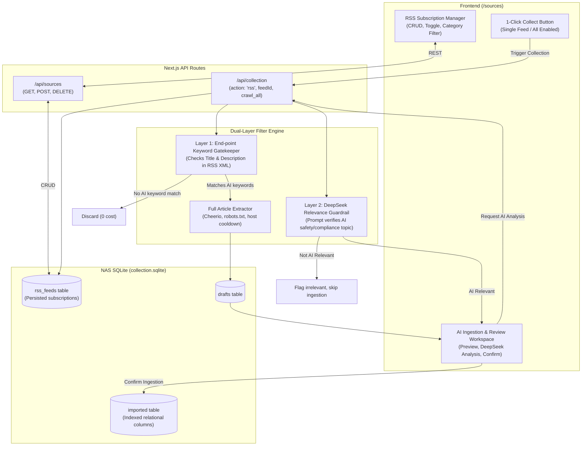

# Technical Design Specification: Official RSS Feed Ingestion, Dual-Layer AI Safety Filtering & Persistent Subscription Management

- **Date**: 2026-09-11
- **Status**: Approved by User
- **Target Repo**: `ai-radar-platform` (deployed on QNAP NAS at `192.168.1.107` / `https://radar.wilsongo.top`)

---

## 1. Context & Business Value

### 1.1 Problem Statement
The user is a Cybersecurity and Data Compliance Consultant using `ai-radar-platform` to track critical intelligence on:
1. Emerging AI regulations and policy developments (e.g., EU AI Act, NIST AI RMF, CAC regulations).
2. Breakthrough AI security products and defensive tooling.
3. High-profile AI security incidents, jailbreaks, prompt injection, data poisoning, or regulatory fines.

Previously:
- RSS collection was limited to manual one-off URL typing in the UI.
- The sources configuration page (`/sources`) used ephemeral React in-memory state; changes were lost on page reload.
- Broad security/regulatory feeds (such as CISA Cybersecurity Alerts or general tech blogs) produce large volumes of non-AI noise (e.g., legacy Windows vulnerabilities, SCADA malware), which would pollute the AI intelligence repository and waste LLM analysis tokens.

### 1.2 Target Objectives
1. **Official RSS Entry Points**: Preset authoritative official feeds across Regulatory/Policy, AI Security Research, and Frontier AI Lab Security.
2. **Dual-Layer Precision Filtering**: Strictly filter out non-AI cybersecurity noise. General feeds must pass through a keyword gatekeeper before full-text scraping, followed by DeepSeek relevance validation.
3. **Full Frontend Configurability**: Users can add, edit, toggle enable/disable, and delete RSS subscriptions directly from the `/sources` UI.
4. **Persistent SQLite Storage**: Subscriptions are stored in NAS SQLite (`collection.sqlite`) under `rss_feeds`, surviving container restarts and upgrades.
5. **Streamlined Ingestion Pipeline**: 1-click single-feed or batch collection directly feeding into DeepSeek AI analysis and one-click knowledge base ingestion.

---

## 2. Architecture & Data Flow



---

## 3. Data Model: `rss_feeds` Table

Added to `lib/collection-store.mjs` migration routine:

```sql
CREATE TABLE IF NOT EXISTS rss_feeds (
  id TEXT PRIMARY KEY,
  name TEXT NOT NULL,
  url TEXT UNIQUE NOT NULL,
  category TEXT NOT NULL,          -- '监管政策' | 'AI安全' | '头部厂商' | '行业资讯'
  description TEXT,
  filter_keywords TEXT,           -- Comma-separated or JSON array of required keywords (null/empty = all)
  enabled INTEGER DEFAULT 1,        -- 1: enabled, 0: disabled
  cadence TEXT DEFAULT '每天',
  last_fetched_at TEXT,
  created_at TEXT NOT NULL
);

CREATE INDEX IF NOT EXISTS idx_rss_category ON rss_feeds(category);
CREATE INDEX IF NOT EXISTS idx_rss_enabled ON rss_feeds(enabled);
```

### 3.1 Preset Official Feeds Catalog

On initial boot or when the user clicks "恢复官方预置", the system seeds `rss_feeds` with high-quality feeds:

1. **CISA Cybersecurity Alerts** (监管政策)
   - URL: `https://www.cisa.gov/cybersecurity-advisories/all.xml`
   - Filter Keywords: `AI, Artificial Intelligence, Machine Learning, LLM, Generative AI, Deepfake, 算法, 人工智能, 大模型`
   - Note: Strictly filtered to eliminate non-AI vulnerability advisories.
2. **NIST AI News & Updates** (监管政策)
   - URL: `https://www.nist.gov/news-events/news/rss.xml`
   - Filter Keywords: `AI, Artificial Intelligence, Machine Learning, RMF, LLM, Model, Safety`
3. **OWASP GenAI Security Project** (AI安全)
   - URL: `https://genai.owasp.org/feed/`
   - Filter Keywords: `` (Direct feed, full intake)
4. **Trail of Bits Security Blog** (AI安全)
   - URL: `https://blog.trailofbits.com/feed/`
   - Filter Keywords: `AI, Machine Learning, LLM, Neural, Model, Prompt`
5. **OpenAI Newsroom** (头部厂商)
   - URL: `https://openai.com/news/rss.xml`
   - Filter Keywords: `` (Direct feed, full intake)
6. **Anthropic News** (头部厂商)
   - URL: `https://www.anthropic.com/feed`
   - Filter Keywords: `` (Direct feed, full intake)
7. **Google Security Blog** (头部厂商)
   - URL: `https://feeds.feedburner.com/GoogleOnlineSecurityBlog`
   - Filter Keywords: `AI, LLM, Gemini, Machine Learning, Artificial Intelligence, Model, Deepfake`
8. **Microsoft Security Blog** (头部厂商)
   - URL: `https://www.microsoft.com/en-us/security/blog/feed/`
   - Filter Keywords: `AI, Copilot, Machine Learning, LLM, Generative AI, Artificial Intelligence`

---

## 4. Dual-Layer AI Relevance Filtering

### 4.1 Layer 1: Feed-Level Keyword Gatekeeper
In `lib/collection-fetch.mjs` and `app/api/collection/route.js`:
- When parsing the RSS XML buffer in `extractFeed(buffer, url, filterKeywords)`:
  - For each `<item>` or `<entry>`, evaluate `<title>` and `<description>` / `<summary>`.
  - If `filterKeywords` is configured:
    - Tokenize `filterKeywords` by commas.
    - Check case-insensitively if any keyword appears in the title or summary.
    - If no keyword matches, the entry is skipped before initiating any HTTP request for the full webpage.
- Direct benefits: **Zero unnecessary web requests, zero rate-limit penalties on external sites, zero LLM token consumption.**

### 4.2 Layer 2: DeepSeek Relevance Guardrail
In `app/api/collection/route.js` during the `action: 'analyze'` step:
- The system prompt enforces:
  > "你必须首先判断该素材是否与人工智能（AI/大模型/机器学习/算法）的安全、合规、监管、漏洞、滥用或风险治理相关。若完全属于传统软硬件漏洞（如普通操作系统补丁、非AI工控漏洞）且与AI无关，返回 isRelevant: false。对于相关内容，输出 isRelevant: true 以及常规的 summary, category, tags, impact, action。"
- The response schema is validated:
  - If `isRelevant === false`, the article is flagged as `[非AI相关]` in the UI and automatically deselected from ingestion.

---

## 5. Backend REST API Specifications

### 5.1 `GET /api/sources`
- **Description**: Return all RSS subscriptions ordered by `category`, `name`. If the table is empty, auto-seed with presets.
- **Response**:
```json
{
  "sources": [
    {
      "id": "feed-cisa-alerts",
      "name": "CISA Cybersecurity Alerts",
      "url": "https://www.cisa.gov/cybersecurity-advisories/all.xml",
      "category": "监管政策",
      "filterKeywords": "AI, Artificial Intelligence, Machine Learning, LLM, Generative AI, Deepfake",
      "enabled": 1,
      "cadence": "每天",
      "lastFetchedAt": "2026-09-11T20:30:00.000Z",
      "createdAt": "2026-09-11T20:00:00.000Z"
    }
  ]
}
```

### 5.2 `POST /api/sources`
- **Action `save`**: Add new or update existing feed.
  - Body: `{ action: "save", feed: { id?, name, url, category, filterKeywords, enabled, cadence } }`
  - Validation: Valid HTTPS URL, non-empty name, allowed category.
- **Action `toggle`**: Quickly flip `enabled` (1 or 0).
  - Body: `{ action: "toggle", id, enabled }`
- **Action `reset`**: Reset subscriptions to official preset catalog.
  - Body: `{ action: "reset" }`

### 5.3 `DELETE /api/sources?id=<feedId>`
- **Description**: Permanently remove the feed from SQLite.
- **Response**: `{ "success": true }`

### 5.4 `POST /api/collection` (Multi-Feed Extension)
- Supports existing `action: 'rss'` with direct URL.
- Added support for `action: 'crawl_feed', feedId: '...'`:
  - Reads `filterKeywords` from feed configuration in SQLite.
  - Performs Layer 1 keyword filtering.
  - Returns filtered draft articles and skips report.
- Added support for `action: 'crawl_all_enabled'`:
  - Iterates through all feeds where `enabled = 1`.
  - Gathers candidate articles across feeds while strictly observing host cooldowns (1.5s delay between requests to same host).

---

## 6. Frontend Subscription Management (`/sources` & `RadarConsole.jsx`)

1. **Category Navigation & Stats**:
   - Filter chips: 全部, 监管政策, AI安全, 头部厂商, 自定义.
   - Live badge counters per category.
2. **Top Action Bar**:
   - `＋ 新增 RSS 订阅`: Opens modal with URL validation and keyword filter builder.
   - `🔄 一键拉取所有启用源`: Triggers batch collection across all active feeds.
   - `⚡ 恢复官方预置`: Restores standard vetted catalog with 1 click.
3. **Feed Cards**:
   - Toggle switch (instant API persistence).
   - Display of active filter keywords tag pills.
   - Status: Last collected time & status indicator.
   - Actions: `[⚡ 立即采集]`, `[✏️ 编辑]`, `[🗑️ 删除]`.
4. **Interactive Ingestion Workspace (`ManualCollection.jsx` integrated)**:
   - When a user clicks `立即采集`, the articles list updates with the freshly extracted drafts matching AI criteria.
   - DeepSeek batch analysis button runs analysis on checked items.
   - One-click "全部入库" or individual "确认入库" writes articles into SQLite `imported` table.

---

## 7. Security & Compliance Safeguards

1. **SSRF Prevention**: `isPublicAddress()` blocks loopback, private ranges (`10.0.0.0/8`, `192.168.0.0/16`, `172.16.0.0/12`), link-local (`169.254.0.0/16`), and IPv6 equivalents.
2. **DNS Rebinding Protection**: IP address is resolved via `node:dns/promises` and pinned to the HTTPS socket.
3. **Robots.txt & Crawl-Delay**: Adheres to `robots.txt` rules per site using `robots-parser`.
4. **Host Cooldown**: Strict 10-minute host cooldown prevents hammering target servers.
5. **No Client Database Leakage**: Node SQLite and file operations remain strictly in server-side API routes and `lib/collection-store.mjs`, preserving clean Next.js client bundle.

---

## 8. Verification & Deployment Plan

1. **Automated Unit Tests**:
   - Test feed keyword extraction in `tests/collection.test.mjs`.
   - Test `rss_feeds` CRUD & presets seeding in `tests/collection.test.mjs`.
   - Test `/api/sources` route in automated test runner.
2. **Next.js Production Build**:
   - Run `npm run build` locally to verify 0 Webpack client/server boundary violations.
3. **NAS Deployment**:
   - Package via `./deploy-nas.sh pack`.
   - Upload via `scp` to QNAP NAS (`Wilson-Home`).
   - Rebuild Docker container via `nas_run.sh` / Container Station.
4. **Live Verification**:
   - Verify `GET https://radar.wilsongo.top/api/sources` returns initial preset feeds.
   - Verify adding, editing, and deleting feeds via the UI.
   - Verify that CISA / broad feeds accurately filter non-AI articles and retain AI-relevant items.
