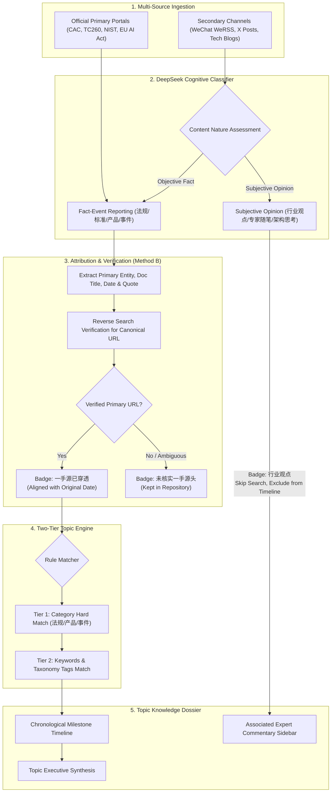

# Technical Design Specification: Topic Knowledge Timelines, Secondary Source Attribution & Opinion-Event Separation

- **Date**: 2026-09-12
- **Status**: Ready for User Review
- **Target Repo**: `ai-radar-platform` (deployed on QNAP NAS at `192.168.1.107` / `https://radar.wilsongo.top`)

---

## 1. Context & Core Vision

### 1.1 Problem Statement & Strategic Shift
In AI safety, governance, and cyber compliance, scattered news articles (原子资讯) have limited standalone value. Compliance leaders and security directors do not just need to read daily articles; they need **coherent, longitudinal knowledge trajectories (时间线进展与结构化知识)** to guide enterprise action.

Currently:
1. Intelligence is stored and browsed flatly by publication date, without chronological continuity or storyline tracking.
2. WeChat official accounts (微信公众号) and X (Twitter) provide valuable, rapid analysis, but are largely **secondary sources (二手信息)**. If an article cites an official regulation or security incident that was not directly crawled from the primary portal, it lacks verified provenance and exact primary timing.
3. WeChat and X content is heterogeneous: some articles report objective regulatory/security milestones, while others are purely subjective expert opinions, architectural essays, or personal viewpoints. Mixing them dilutes the factual integrity of timeline milestones.

### 1.2 Target Objectives
1. **Three Rigid Top-Level Topic Categories**:
   - `AI 法规动态` (Regulatory, standards, guidelines, 备案 lists)
   - `AI 安全产品动态` (Guardrails, prompt shields, defense architectures, red teaming frameworks)
   - `事件动态` (Vulnerabilities, CVEs, jailbreaks, data leaks, enforcement actions & fines)
2. **Two-Tier Topic Extraction Engine**:
   - Tier 1: Category Match (rigid boundary isolation).
   - Tier 2: Keywords and Taxonomy Tags Match (Boolean conjunction / disjunction).
3. **Secondary Source Attribution Engine (Method B - DeepSeek Extraction + Reverse Search Verification)**:
   - DeepSeek parses secondary articles to identify the primary issuing authority, original document title, original date, and citation quotes.
   - Automated search verification resolves and attaches the canonical primary URL.
   - Timeline alignment uses the **original verified date** rather than the secondary repost date.
4. **Explicit Separation of Facts vs. Opinions**:
   - **Fact Reporting (事实动态)**: Undergoes source attribution. If verified, attaches `一手源已穿透` badge and qualifies for topic timelines. If unverified, attaches `未核实一手源头` badge and remains in the repository without contaminating timelines.
   - **Opinion & Commentary (行业观点)**: Identified by DeepSeek. **Skips external source verification** and **does not form timeline milestone events**. Attached with a distinct `行业观点` / `专家随笔` badge, surfaced in topics as contextual reference readings.
5. **Preset + Custom Topics**: Pre-configure 4 canonical enterprise topics, while allowing users to create custom topics under the 3 categories.

---

## 2. End-to-End System Architecture



---

## 3. Detailed Data Models & Database Schema

### 3.1 SQLite `topics` Table
Persisted in `collection.sqlite` to manage preset and custom topics:

```sql
CREATE TABLE IF NOT EXISTS topics (
  id TEXT PRIMARY KEY,
  title TEXT NOT NULL,
  category TEXT NOT NULL CHECK (category IN ('AI 法规动态', 'AI 安全产品动态', '事件动态')),
  rule_keywords TEXT NOT NULL,          -- JSON array of keywords, e.g. ["中国", "网信办", "生成式人工智能"]
  rule_tags TEXT,                      -- JSON array of canonical taxonomy tags
  summary TEXT,                        -- DeepSeek synthesized executive brief
  is_preset INTEGER DEFAULT 0,         -- 1 = system default, 0 = user created
  sort_order INTEGER DEFAULT 100,
  created_at TEXT NOT NULL,
  updated_at TEXT NOT NULL
);

CREATE INDEX IF NOT EXISTS idx_topics_category ON topics(category);
```

### 3.2 Additions to `imported` Table (Atomic Intelligence)
Store attribution metadata and nature classifications:

```sql
ALTER TABLE imported ADD COLUMN content_nature TEXT DEFAULT 'fact'; -- 'fact' | 'opinion'
ALTER TABLE imported ADD COLUMN source_origin TEXT DEFAULT 'direct'; -- 'direct' | 'wechat' | 'x_post' | 'web'
ALTER TABLE imported ADD COLUMN primary_authority TEXT;             -- e.g. '国家互联网信息办公室'
ALTER TABLE imported ADD COLUMN primary_doc_title TEXT;            -- e.g. '生成式人工智能服务已备案信息'
ALTER TABLE imported ADD COLUMN primary_date TEXT;                 -- e.g. '2024-03-08'
ALTER TABLE imported ADD COLUMN primary_url TEXT;                  -- e.g. 'https://www.cac.gov.cn/...'
ALTER TABLE imported ADD COLUMN primary_quote TEXT;                -- Citation excerpt
ALTER TABLE imported ADD COLUMN verification_status TEXT DEFAULT 'verified'; -- 'verified' | 'unverified' | 'opinion'
```

---

## 4. DeepSeek Prompt & Pipeline Enhancements

### 4.1 Single-Pass Classification & Extraction Prompt
In `app/api/collection/route.js`, update the system prompt to classify `contentNature` and perform secondary extraction:

```json
{
  "contentNature": "fact", // "fact" (事实事件报道) 或 "opinion" (行业观点/随笔/评论)
  "intelligenceType": "法规政策", // 严格三选一对应: 法规政策 | 安全产品突破 | 违规处罚与事件 (行业动态归并)
  "sourceAttribution": {
    "isSecondary": true, // 若文章来源为微信/X/自媒体且在转述第三方事件，填 true
    "primaryAuthority": "国家互联网信息办公室", // 原始发布机构，未提及或纯原创填 "未指明"
    "primaryDocTitle": "生成式人工智能服务已备案信息公告", // 原文件或核心事件官方名称
    "primaryDate": "2024-03-08", // 原始公开发布日期 YYYY-MM-DD，若未提及留空
    "primaryUrl": "", // 若正文直接包含原始链接则填入，否则留空由后台反查
    "citationQuote": "根据中国网信网3月8日发布的最新备案清单..." // 原文中指明出处的证据原句
  },
  "summary": "...",
  "detailTag": "...",
  "affectedEntity": "...",
  "tags": ["..."],
  "impact": "...",
  "action": "..."
}
```

### 4.2 Reverse Search Verification Engine (Method B)
A backend verification helper `lib/source-verifier.mjs`:
1. If `isSecondary === true` and `primaryAuthority !== "未指明"`:
   - Check if `primaryUrl` was already extracted from text.
   - If missing, construct targeted search queries (e.g. `site:gov.cn 国家互联网信息办公室 生成式人工智能服务已备案信息` or authoritative domains `europa.eu`, `nist.gov`, `cisa.gov`, `openai.com`).
   - Run lightweight search query and inspect the top 3 results for domain authority match.
   - If a valid official URL is found, set `primary_url = foundUrl` and `verification_status = 'verified'`.
   - If no authoritative source can be matched after search, set `verification_status = 'unverified'`.
2. If `contentNature === 'opinion'`:
   - Set `verification_status = 'opinion'`.
   - Skip search step entirely to conserve latency and API calls.

---

## 5. Topic Matching & Timeline Assembly Engine

### 5.1 Two-Tier Matching Logic (`lib/topic-matcher.mjs`)
When assembling a Topic's timeline, query the database using:

```javascript
export function matchArticleToTopic(article, topic) {
  // 1. Content Nature Gate: Opinions are strictly excluded from timeline milestones
  if (article.contentNature === 'opinion') return false;

  // 2. Verification Gate: Unverified secondary sources do not enter official timelines
  if (article.verificationStatus === 'unverified') return false;

  // 3. Tier 1: Category Boundary Match
  const categoryMap = {
    'AI 法规动态': ['法规政策', '合规动态'],
    'AI 安全产品动态': ['安全产品突破', '产品突破'],
    '事件动态': ['违规处罚与事件', '安全事件']
  };
  const allowedCategories = categoryMap[topic.category] || [];
  if (!allowedCategories.includes(article.intelligenceType) && !allowedCategories.includes(article.category)) {
    return false;
  }

  // 4. Tier 2: Keywords & Taxonomy Tags Match
  const keywords = Array.isArray(topic.ruleKeywords) ? topic.ruleKeywords : JSON.parse(topic.ruleKeywords || '[]');
  if (keywords.length === 0) return true;

  const haystack = [
    article.title,
    article.summary,
    article.detailTag,
    article.affectedEntity,
    ...(article.tags || [])
  ].join(' ').toLowerCase();

  // Support tokenized Boolean matching: each keyword item can be single or OR-grouped
  return keywords.every(kwGroup => {
    const options = String(kwGroup).split('|').map(s => s.trim().toLowerCase()).filter(Boolean);
    return options.some(opt => haystack.includes(opt));
  });
}
```

### 5.2 Timeline Chronology Alignment
- Sort timeline milestones by `article.primaryDate || article.publishedAt` (ascending or descending).
- Display a **Dual-Source Badge**:
  - Direct Source: `[官方直采] 国家网信办 · 2024-03-08`
  - Verified Secondary: `[权威穿透] 原始发布: 国家网信办 (2024-03-08) · 解读来源: 某合规公众号 (2024-03-10)`
  - Unverified Secondary: `[暂无官方一手源] 某自媒体 · 仅供背景查阅`

---

## 6. Preset Topics Configuration

The system seeds 4 canonical topics on initial launch:

| 专题名称 | 分类 (3大固定分类) | 关键词抽取规则 (Tier 2) |
| :--- | :--- | :--- |
| **中国生成式人工智能监管全景时间线** | `AI 法规动态` | `["中国\|网信办\|工信部\|TC260", "生成式\|大模型\|算法备案\|深度合成"]` |
| **欧洲 AI 法案落地与合规指南进展** | `AI 法规动态` | `["欧盟\|EU\|欧洲议会", "AI Act\|人工智能法案\|GPAI\|通用目的"]` |
| **国内外前沿 Cyber 模型安全演进** | `AI 安全产品动态` | `["DeepSeek\|OpenAI\|Anthropic\|Claude", "护栏\|Guardrails\|Prompt Shield\|越狱防御\|攻防评测"]` |
| **全球大模型安全漏洞与监管处罚脉络** | `事件动态` | `["漏洞\|CVE\|越狱\|投毒\|窃密\|数据泄露\|罚单\|通报\|下架"]` |

---

## 7. UI/UX Specifications (Deloitte Consulting Modern Aesthetic)

### 7.1 Visual Badges (Strictly No Emoji)
- **Verified Primary**: Dark green outline badge `[一手源已穿透]` (`#15803d`, background `#f0fdf4`, border `#bbf7d0`).
- **Unverified Secondary**: Amber outline badge `[未核实一手源头]` (`#b45309`, background `#fefce8`, border `#fef08a`).
- **Opinion & Commentary**: Indigo/slate badge `[行业观点]` (`#4338ca`, background `#eef2ff`, border `#c7d2fe`).
- **Direct Source**: Neutral slate badge `[官方一手]` (`#334155`, background `#f8fafc`, border `#e2e8f0`).

### 7.2 Topic Timeline & Dossier Layout
1. **Top Nav**: Clean tab with 3 category pills (`全部`, `AI 法规动态`, `AI 安全产品动态`, `事件动态`) + `[+ 新建专题]` button.
2. **Left Panel**: Topics card list with count of milestones, latest update date, and category tag.
3. **Main Workspace**:
   - **Executive Summary Box**: Top container with high-density summary of the topic's current status and key compliance implications.
   - **Timeline Stream**: Vertical connected timeline nodes showing verified milestones with original dates, primary authority badges, and link to primary source.
   - **Sidebar**: "关联行业观点与深度解读 (Expert Perspectives & Commentary)" displaying opinion articles matching the topic's keywords, providing diverse analytical viewpoints without cluttering the factual timeline.

---

## 8. Verification & Test Plan

1. **Unit Tests (`npm test`)**:
   - `test/source-attribution.test.mjs`: Test DeepSeek prompt extraction parsing for secondary sources.
   - `test/topic-matcher.test.mjs`: Validate Tier 1 category isolation and Tier 2 Boolean keyword matching.
   - `test/opinion-separation.test.mjs`: Verify that opinion articles receive the `opinion` status and are excluded from timeline arrays while being included in commentary references.
2. **End-to-End Ingestion Test**:
   - Ingest a sample WeChat article summarizing CAC 5th-batch GenAI filings.
   - Confirm it extracts `CAC` as primary authority, aligns date to official notice date, and attaches to "中国生成式人工智能监管全景时间线".
   - Ingest a sample blog post with personal opinions on AI safety. Confirm it receives `[行业观点]` badge, skips search, and does not appear on the timeline.
3. **Build & NAS Deployment Check**:
   - `npm run build` with zero warnings.
   - Hot-reload deployment on NAS container (port 3100 -> 3000).
